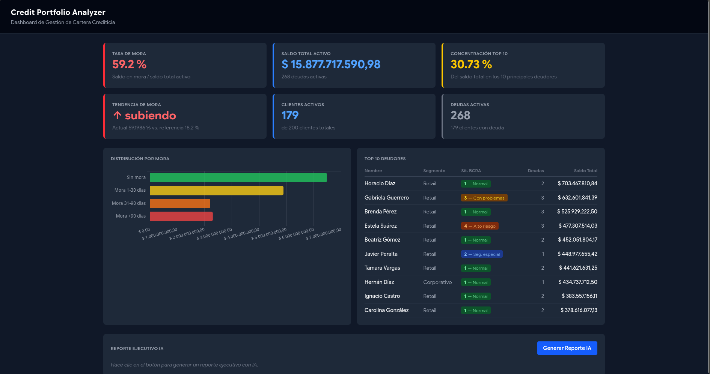

# Credit Portfolio Analyzer


Dashboard de análisis de cartera crediticia bancaria con reportes ejecutivos generados por IA.
Construido con Python + Flask en el backend y React + Tailwind en el frontend, sobre datos sintéticos
argentinos con clasificación BCRA real.



---

## Contexto y motivación

Trabajé 7 años como Oficial de Negocios en el Banco de la Nación Argentina, donde parte de mi
trabajo era analizar la cartera de clientes: revisar situaciones de mora, preparar reportes para
la gerencia, detectar concentración de riesgo y hacer seguimiento de deudores en situación BCRA
3, 4 y 5.

Ese trabajo se hacía mayormente de forma manual — exportando datos a Excel, armando tablas pivot,
escribiendo resúmenes a mano. **Credit Portfolio Analyzer** automatiza exactamente ese flujo:
conecta la base de datos, calcula los KPIs relevantes y genera un reporte ejecutivo en lenguaje
natural usando IA.

El proyecto también me sirvió para demostrar que el dominio de negocio bancario y las habilidades
técnicas no son excluyentes — y para hacer la transición hacia roles de Analista Funcional /
Business Systems Analyst en el sector fintech.

---

## Features

- **6 KPIs en tiempo real**: tasa de mora, saldo total activo, índice de concentración top-10,
  tendencia de mora, clientes activos y deudas activas
- **Clasificación BCRA correcta**: la situación del deudor se calcula como el máximo de sus
  deudas, tal como exige la Comunicación A 2216/6938
- **Gráfico de distribución por mora**: barras horizontales con los 4 buckets (sin mora,
  1-30, 31-90, +90 días) en colores semafóricos
- **Top 10 deudores**: tabla con nombre, segmento, situación BCRA y saldo total en ARS
- **Reporte ejecutivo con IA**: narrativa generada por LLaMA 3.3 70B (vía Groq) con análisis
  de alertas, riesgos y recomendaciones accionables
- **Dashboard dark mode** con paleta profesional

---

## Stack tecnológico

| Capa             | Tecnología                        | Propósito                                      |
|------------------|-----------------------------------|------------------------------------------------|
| Base de datos    | SQLite 3                          | Persistencia local, sin infraestructura        |
| Datos sintéticos | Python stdlib                     | 200 clientes, 336 deudas con distribución BCRA |
| Análisis SQL     | sqlite3 (stdlib)                  | 6 queries de KPIs de cartera                   |
| Análisis Python  | Pandas                            | Índice de concentración, tendencia de mora     |
| Backend          | Flask 3.1 + flask-cors            | API REST con 7 endpoints JSON                  |
| IA               | Groq API — LLaMA 3.3 70B          | Reportes ejecutivos en lenguaje natural        |
| Frontend         | React 18 + Vite + Tailwind CSS v4 | Dashboard interactivo                          |
| Gráficos         | Chart.js + react-chartjs-2        | Visualización de distribución de mora          |
| HTTP client      | Axios                             | Comunicación frontend → backend                |
| Testing          | pytest (101 tests)                | Cobertura de queries, análisis, API y rutas    |

---

## Arquitectura

```
┌──────────────┐     ┌───────────────────────────────────────────────────┐
│   seed.py    │────▶│                    SQLite DB                      │
│ 200 clientes │     │  clientes · deudas · productos · pagos · v_cartera│
│ 336 deudas   │     └────────────────────────┬──────────────────────────┘
└──────────────┘                              │
                                              ▼
                         ┌────────────────────────────────────┐
                         │           Backend Flask            │
                         │                                    │
                         │  queries.py ──▶ analysis.py        │
                         │       └──────▶ ai_report.py        │
                         │                   │ (Groq API)     │
                         │             routes.py              │
                         │          7 endpoints REST          │
                         └─────────────────┬──────────────────┘
                                           │  HTTP /api/*
                                           │  proxy Vite
                                           ▼
                         ┌────────────────────────────────────┐
                         │       Frontend React + Vite        │
                         │                                    │
                         │  KpiCards · MoraChart · Tabla      │
                         │  AiReport (reporte ejecutivo IA)   │
                         └────────────────────────────────────┘
```

---

## Instalación

### Prerrequisitos

- Python 3.11+
- Node.js 18+
- Una API key de Groq (gratuita en [console.groq.com](https://console.groq.com))

### 1. Clonar el repositorio

```bash
git clone https://github.com/francisconicolini/credit-portfolio-analyzer.git
cd credit-portfolio-analyzer
```

### 2. Backend

```bash
# Crear y activar entorno virtual
python3 -m venv backend/venv
source backend/venv/bin/activate          # Linux/macOS
# backend\venv\Scripts\activate           # Windows

# Instalar dependencias
pip install -r backend/requirements.txt

# Configurar variables de entorno
cp backend/.env.example backend/.env
# Editar backend/.env y completar GROQ_API_KEY

# Generar base de datos con datos sintéticos
python3 backend/data/seed.py

# Iniciar el servidor (puerto 5000)
cd backend && python run.py
```

### 3. Frontend

```bash
# En otra terminal, desde la raíz del proyecto
cd frontend
npm install
npm run dev
# → http://localhost:5173
```

---

## Uso

### Dashboard

Al abrir `http://localhost:5173` con el backend corriendo, el dashboard carga automáticamente
los KPIs desde `GET /api/kpis`. Se muestran:

- **Fila superior**: 6 tarjetas con indicadores clave y colores semafóricos
- **Fila inferior izquierda**: gráfico de barras con distribución por tramos de mora
- **Fila inferior derecha**: tabla con los 10 principales deudores por saldo

### Reporte ejecutivo IA

Hacé clic en **"Generar Reporte IA"** en la parte inferior del dashboard. El sistema llama
a `GET /api/reporte`, construye el payload de KPIs y lo envía a LLaMA 3.3 70B vía Groq.
El reporte aparece en ~5-10 segundos con tres secciones: Resumen Ejecutivo, Alertas y Riesgos,
y Recomendaciones Accionables.

> Requiere `GROQ_API_KEY` configurada en `backend/.env`.

### Regenerar datos sintéticos

```bash
source backend/venv/bin/activate
python3 backend/data/seed.py
```

Elimina y recrea `backend/db/portfolio.db` con 200 clientes y distribución de mora controlada
(47 % sin mora · 27 % mora 1-30d · 16 % mora 31-90d · 10 % mora severa).

---

## Tests

```bash
source backend/venv/bin/activate
pytest backend/tests/ -v
```

**101 tests · 4 suites:**

| Suite               | Tests | Qué cubre                                                   |
|---------------------|-------|-------------------------------------------------------------|
| `test_queries.py`   | 38    | Las 6 funciones SQL: estructura, valores, consistencia      |
| `test_analysis.py`  | 29    | Índice de concentración, tendencia de mora, formato ARS     |
| `test_ai_report.py` | 13    | Generación de reportes con Groq mockeado (sin consumir API) |
| `test_routes.py`    | 21    | Los 7 endpoints Flask: status codes, estructura JSON, campos|

---

## Decisiones técnicas

**¿Por qué SQLite y no PostgreSQL?**
El proyecto corre localmente sin necesidad de infraestructura. SQLite es suficiente para
200-300 clientes y permite que cualquiera clone y corra el proyecto en menos de 2 minutos,
sin configurar servidores ni credenciales de base de datos.

**¿Por qué Groq y no OpenAI?**
Groq ofrece inferencia de LLaMA 3.3 70B con latencia muy baja (~5s para este prompt) y un
tier gratuito generoso. Para un proyecto de portfolio que puede ser ejecutado por reclutadores
o revisores técnicos, eliminar la fricción del costo es una ventaja real.

**¿Por qué datos sintéticos y no datos reales?**
Los datos de cartera bancaria son confidenciales bajo regulación BCRA y leyes de privacidad
financiera. El generador sintético (`seed.py`) replica fielmente la distribución estadística
real: buckets de mora, situaciones BCRA, segmentos y productos típicos del mercado argentino.

**¿Por qué Flask y no FastAPI?**
Flask es más directo para una API REST síncrona sin websockets ni background tasks. Los 7
endpoints son operaciones de lectura sobre SQLite — no hay escenario donde el async de FastAPI
aporte valor aquí.

---

## Próximas mejoras

- [ ] Autenticación con JWT y roles (gerente / analista)
- [ ] Filtros por fecha, segmento y situación BCRA en todos los endpoints
- [ ] Exportar reporte ejecutivo a PDF con `weasyprint`
- [ ] Modo multi-cartera: gestionar varias sucursales en paralelo
- [ ] Deploy en Railway (backend) + Vercel (frontend)
- [ ] Historial de reportes: guardar y comparar reportes generados en el tiempo
- [ ] Alertas automáticas cuando la tasa de mora supera umbrales configurables

---

## Autor

**Francisco Nicolini**
Ex-Oficial de Negocios del Banco de la Nación Argentina (7 años) en transición hacia
Analista Funcional / Business Systems Analyst en el sector fintech.

[](https://www.linkedin.com/in/francisconicolini/)
[](https://github.com/francisconicolini)

---

## Licencia

MIT
